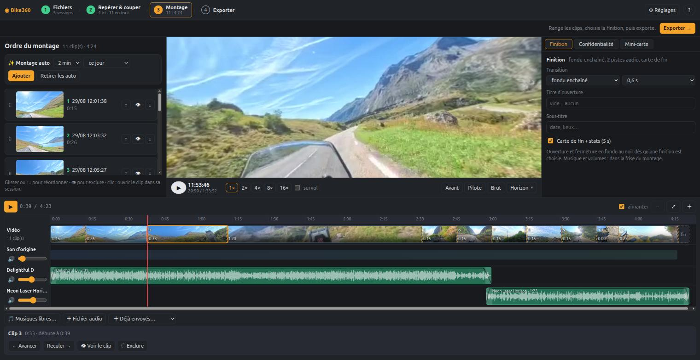
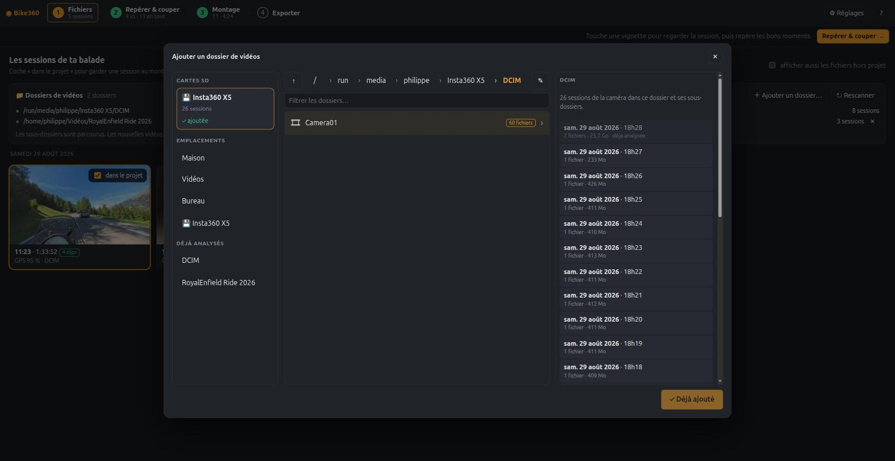
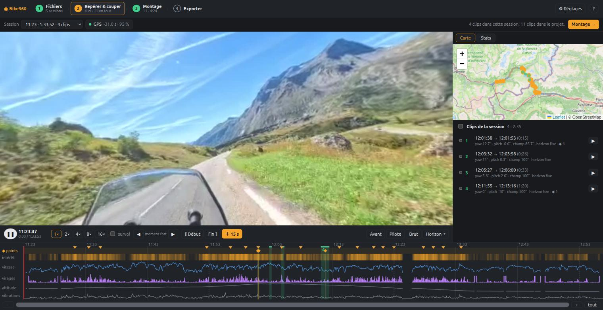
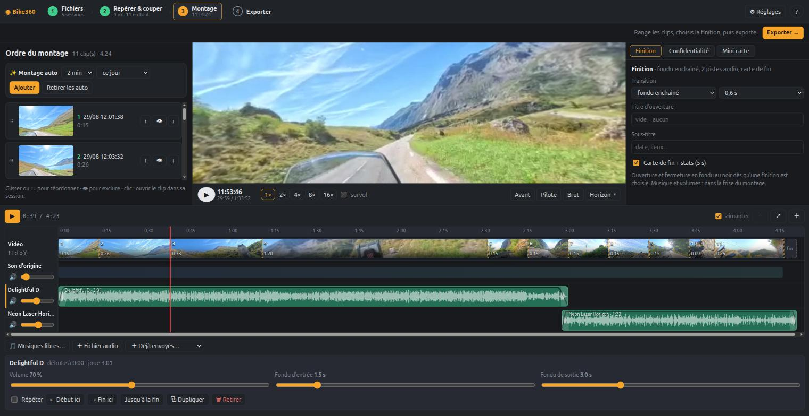
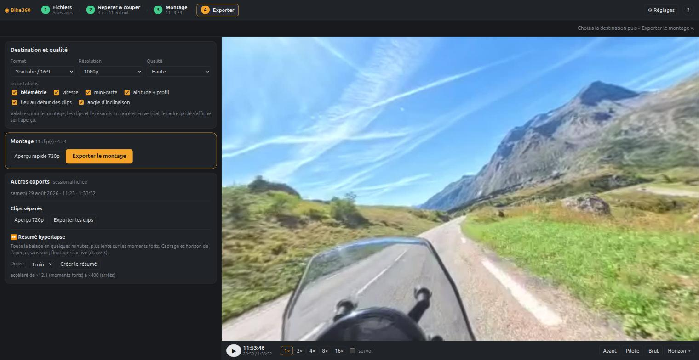

<div align="center">

# ◉ Bike360

**Tri et montage des balades à moto filmées avec une Insta360 X5.**
On repère les bons moments, on cadre la vue 360°, on monte les clips avec la musique, on floute les visages et les plaques, puis on exporte une vidéo prête à publier.




</div>

Tout tourne **chez vous**, dans le navigateur : pas de compte, pas de cloud. Vos vidéos, vos
positions GPS et vos exports ne quittent pas votre machine.

## En un coup d'œil

| | |
| --- | --- |
| **① Fichiers** | Branchez la carte SD ou choisissez un dossier : les sessions sont détectées, analysées, et les nouveaux fichiers repérés tout seuls. |
| **② Repérer & couper** | Frise des vitesses, virages et moments forts, carte du trajet, cadrage libre de la vue 360° avec points clés, accélérés. |
| **③ Montage** | Les clips en blocs sur une frise, des pistes audio multiples, transitions, titre, carte de fin avec statistiques. |
| **④ Exporter** | YouTube 16:9, vertical 9:16, carré, léger ; incrustations (vitesse, mini-carte, altitude, inclinaison) ; chapitres YouTube. |

## Visite guidée

### ① Fichiers : dossiers, cartes SD et analyse automatique

Un navigateur de dossiers à trois panneaux : les cartes SD détectées, vos emplacements et, à
droite, un **aperçu des sessions trouvées** (date, durée, taille) avant d'ajouter quoi que ce soit.
Le bouton « Rescanner » relance l'analyse à la demande, avec progression et temps restant, et le
serveur repère seul les nouveaux fichiers dès que la copie est terminée. Les sessions sont regroupées
par balade ; sur chaque carte, on indique où la caméra est fixée (guidon, casque, arrière…).

Au même endroit, on dépose une **trace GPS** `.gpx` (téléphone, GPS de guidon, traceur) : elle sert
de source de positions pour les sessions de ce jour-là.



### ② Repérer & couper

Le profil de la balade seconde par seconde (IMU, GPS d'une trace `.gpx` ou de GeoRide) fait ressortir les
moments forts. On pose des clips en un geste (⟦ Début, Fin ⟧ ou ＋15 s), on cadre la vue, on
règle un horizon mesuré **dans l'image** et on accélère les passages calmes.



### ③ Montage : une vraie frise, vidéo et audio

- Les clips sont des **blocs vidéo** à leur place réelle, transitions comprises ; on les réordonne en les glissant.
- Jusqu'à 8 **pistes audio** : on les déplace, on rogne leurs bords, on règle volume et fondus, on les répète.
  Forme d'onde, aimantation aux bords des clips, zoom.
- Le **son d'origine** (moteur, vent) a sa propre piste et son volume.
- **Écoute du mixage** : l'aperçu vidéo suit la tête de lecture, avec le son d'origine et les musiques.



### ④ Exporter



Le montage est rendu en une seule passe : transitions, titre, musiques mixées avec leurs crédits,
carte de fin. Les exports peuvent s'appuyer sur le **moteur GPU** (NVDEC → CUDA → NVENC), environ
cinq fois plus rapide que ffmpeg seul.

## Fonctions

- **Analyse des sessions** : moments forts, statistiques, horizon mesuré dans l'image (Viterbi),
  angle d'inclinaison de la moto, synchronisation caméra ↔ GPS.
- **GPS au choix** : trace `.gpx` déposée dans l'interface, ou compte GeoRide. Vitesse et cap sont
  déduits des positions quand le fichier ne les donne pas.
- **Plusieurs caméras** : chaque session garde le modèle et le numéro de série de sa caméra ; la
  position choisie pour une caméra (guidon, casque, poitrine, arrière, perche) fixe sa direction
  « avant » ; deux caméras qui filment le même moment sont signalées comme deux angles.
- **Confidentialité** : floutage des visages et des plaques (détection, suivi dans le temps,
  zones tracées à la main), mesure des fuites.
- **Hyperlapse** : toute une balade en quelques minutes, plus lente sur les moments forts.
- **Deux interfaces** : ordinateur et téléphone, avec choix automatique.
- **Accès protégé** : mot de passe, page de connexion, cookie signé, essais limités.

## Avec ou sans carte NVIDIA

Le moteur GPU est **facultatif**, mais certaines fonctions en dépendent.

| Fonction | Avec NVIDIA (CUDA + NVENC) | Sans NVIDIA |
| --- | :---: | :---: |
| Analyse, repérage, clips, montage, aperçus 720p | ✅ | ✅ |
| Export final depuis les `.insv` | ✅ rapide (GPU) | ✅ plus lent (ffmpeg, x264 sur processeur) |
| Floutage des visages et des plaques | ✅ | ❌ |
| Suivi d'un élément | ✅ | ❌ |
| Résumé hyperlapse | ✅ | ❌ |

Le moteur est propre à NVIDIA : une carte AMD ou Intel se comporte comme « sans NVIDIA ».
Bike360 est écrit et testé pour **Linux (x86_64)** ; la détection des cartes SD et le service
reposent sur `/proc/mounts`, `/run/media` et systemd.

## Installation

Prérequis : Linux, [Rust](https://rustup.rs) (édition 2024), `ffmpeg` et `ffprobe`.

```sh
git clone https://github.com/PhilippeVienne/bike360.git
cd bike360
sh packaging/install.sh
```

Le script compile, installe dans `~/.local/bin` et active un service utilisateur systemd. Le moteur
GPU n'est compilé que si `nvcc` (kit CUDA) est présent. Les réglages sont dans
`~/.config/bike360/server.env` : dossier de la carte, adresse, port, **mot de passe**
(`BIKE360_PASSWORD`, généré à la première installation). L'interface est ensuite sur
<http://127.0.0.1:8360>.

Sans service : `cargo build --release`, puis
`BIKE360_PASSWORD=… target/release/bike360-server "/chemin/vers/DCIM" --host 127.0.0.1 --port 8360`.

### Mise à jour depuis une version antérieure

L'identifiant d'une session contient désormais la caméra (`VID_<date>_<heure>_<caméra>`). Les données
d'une version antérieure se migrent une fois, serveur arrêté :

```sh
systemctl --user stop bike360
cp -a data data.avant-migration                    # sauvegarde
target/release/bike360-tool migrate-ids            # essai à blanc : affiche ce qui serait renommé
target/release/bike360-tool migrate-ids --apply
sh packaging/install.sh
```

Brancher la carte SD avant de migrer permet de lire la caméra de chaque session ; sinon l'outil
suppose la seule caméra qu'il connaît, et ne devine rien s'il en connaît plusieurs.

### Floutage : modèles

Les modèles ne sont pas dans ce dépôt. Il faut `onnxruntime` (`pip install onnxruntime-gpu`) ; les
modèles de plaques et de véhicules sont téléchargés au premier usage ; pour les visages et le
suivi, placez `face_detection_yunet_2023mar.onnx` et `object_tracking_vittrack_2023sep.onnx`
([OpenCV Zoo](https://github.com/opencv/opencv_zoo)) dans `data/cache/models/`.

## Sécurité

- Le serveur n'a **pas de chiffrement** propre. Pour l'ouvrir hors de la machine, mettez-le
  derrière HTTPS (par exemple [`tailscale serve`](https://tailscale.com/kb/1242/tailscale-serve),
  sans Funnel) et **définissez `BIKE360_PASSWORD`**. Sans mot de passe, n'écoutez que sur `127.0.0.1`.
- Le navigateur de dossiers liste les répertoires du PC à toute personne authentifiée.
- Vos données personnelles (positions GPS, sélections, exports) restent dans `data/` et `exports/`,
  ignorés par git.

## Service hébergé (en préparation)

Le dossier `cloud/` prépare une version hébergée : envoi des rushs depuis le navigateur vers un
stockage S3, bibliothèque de tri et de nettoyage, et serveur en mode hébergé. Rien n'est en service ;
tout s'essaie en local sur un émulateur d'AWS, voir [`cloud/README.md`](cloud/README.md).

Le serveur accepte pour cela des dossiers séparés (`BIKE360_DATA`, `BIKE360_CACHE`,
`BIKE360_EXPORTS`) et un mode hébergé (`BIKE360_CLOUD=1`) où il ne lit que le dossier de rushs
qu'on lui donne, sans explorer le disque ni les cartes SD de sa machine.

## Organisation du code

| Dossier | Rôle |
| --- | --- |
| `core/` | analyse, géométrie, horizon, finition, confidentialité (bibliothèque Rust + tests) |
| `server/` | serveur HTTP, API, exports, authentification |
| `render/` | moteur GPU (NVDEC, noyaux CUDA, NVENC) — compilé seulement avec CUDA |
| `ui/` | interface web en modules ES, sans étape de build |
| `packaging/` | service systemd et script d'installation |
| `cloud/` | service hébergé en préparation : infrastructure Terraform, service d'envoi et de bibliothèque, essais locaux |
| `*.py` | version Python d'origine, gardée comme référence des tests de non-régression |

Tests : `cargo test`.

## Crédits et données tierces

- Cartes © contributeurs [OpenStreetMap](https://www.openstreetmap.org/copyright).
- Musiques libres proposées par l'application : Kevin MacLeod ([incompetech.com](https://incompetech.com)),
  licence CC BY 4.0 — le crédit est ajouté automatiquement à la fin du montage.
- Détection : modèles d'[open-image-models](https://github.com/ankandrew/open-image-models)
  (plaques, véhicules) et YuNet / VitTrack ([OpenCV Zoo](https://github.com/opencv/opencv_zoo)),
  obtenus séparément et soumis à leurs propres licences.
- Positions GPS : API [GeoRide](https://georide.com) (compte personnel requis, facultatif).

Projet indépendant, non affilié à Insta360 ni à GeoRide.

## Licence

[EUPL-1.2](LICENSE) — European Union Public Licence v. 1.2.
